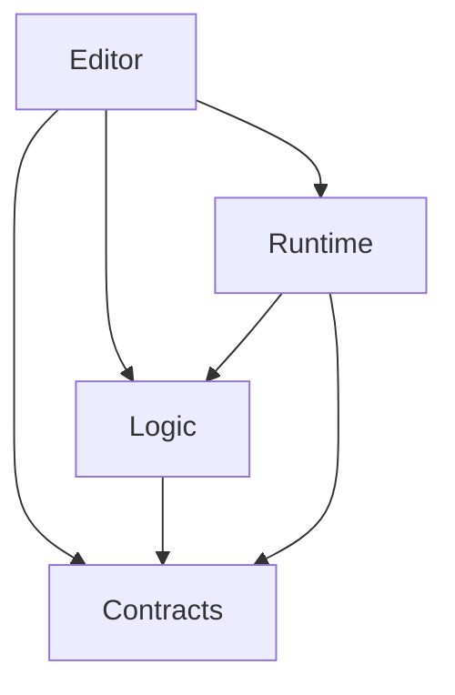
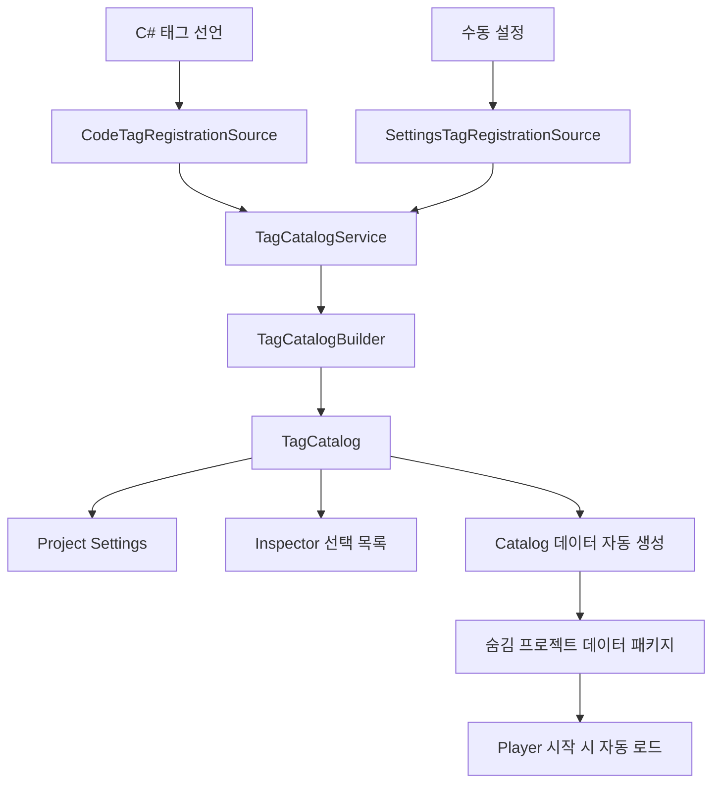
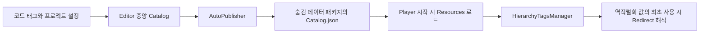

# Hierarchy Tags

점(`.`)으로 계층을 표현하는 Unity용 태그 패키지입니다.

`State.Dead`, `Widget.Modal`, `Device.Door.Open`처럼 대상의 상태나 분류를
표현하고, 코드와 Inspector에서 같은 태그를 사용할 수 있습니다.

언리얼의 Gameplay Tags에서 아이디어를 가져왔으며,
게임과 일반 Unity 애플리케이션에서 사용할 수 있습니다.

Unity 기본 `GameObject.tag`와 별도로 동작합니다.

## 요구 사항

- Unity 6000.4.7f1 이상

## 빠른 시작

1. 코드 또는 Project Settings에서 태그를 등록합니다.
2. 컴포넌트에 `HierarchyTag` 또는 `HierarchyTagContainer` 필드를 선언합니다.
3. Inspector에서 태그를 선택하고 코드에서 비교합니다.

### 1. 코드로 태그 선언하기

일반 C# 파일에 다음처럼 선언합니다.

```csharp
using HierarchyTags;

[HierarchyTagDefinitions]
public static class StateTags
{
    public static readonly HierarchyTag Alive =
        new HierarchyTag("State.Alive");

    public static readonly HierarchyTag Dead =
        new HierarchyTag("State.Dead");
}
```

Unity 컴파일이 완료되면 Editor가 선언을 수집하고,
Hierarchy Tags 설정 창과 Inspector 선택 목록에 표시합니다.

별도의 등록 메서드를 호출할 필요는 없습니다.

코드 선언에는 다음 규칙을 사용합니다.

- 클래스에 `[HierarchyTagDefinitions]`를 지정합니다.
- 클래스는 제네릭이 아닌 `static class`로 선언합니다.
- 필드는 `public static readonly HierarchyTag`로 선언합니다.

`StateTags.Dead`는 C#에서 접근하는 이름이고,
실제 태그 ID는 생성자에 전달한 `State.Dead`입니다.

클래스명과 필드명은 태그의 계층에 포함되지 않습니다.


### 2. 설정 창에서 태그 등록하기

`Edit > Project Settings > Hierarchy Tags`를 엽니다.

**새 태그**에 `Widget.Modal`처럼 전체 태그 ID를 입력하고
**추가** 버튼을 누릅니다.


태그는 하나의 계층 트리로 표시됩니다.

```text
State
├─ Dead  (State.Dead)
└─ Pull  (State.Pull)
```

각 행에는 태그 이름, 전체 ID와 등록 출처가 표시됩니다.

| 출처 | 의미 |
|---|---|
| 코드 | C# 필드에서 선언한 태그 |
| 설정 | Project Settings에서 직접 등록한 태그 |
| 코드 · 설정 | 양쪽에서 같은 태그를 등록한 경우 |
| 자동 부모 | 자식 태그의 계층을 구성하기 위해 만들어진 부모 |

설정에서 등록한 태그는 **이름 변경** 또는 **수동 등록 삭제**로 편집합니다.

코드에서 선언한 태그는 해당 C# 선언을 수정하거나 제거합니다.

### 3. Inspector에서 태그 선택하기

컴포넌트에 직렬화 필드를 선언합니다.

```csharp
using HierarchyTags;
using UnityEngine;

public sealed class TaggedObject : MonoBehaviour
{
    [SerializeField] private HierarchyTag state;
    [SerializeField] private HierarchyTagContainer tags;

    public bool IsDead => state == StateTags.Dead;

    public bool HasDeadTag => tags.HasTagExact(StateTags.Dead);
}
```

컴포넌트를 GameObject에 추가하면 Inspector에서 태그를 선택할 수 있습니다.

- `HierarchyTag`: 태그 하나를 보관합니다.
- `HierarchyTagContainer`: 여러 태그를 중복 없이 보관합니다.

별도의 `InitializeTags()` 호출이나 초기화 컴포넌트는 필요하지 않습니다.

## 샘플 가져오기

Package Manager에서 **HierarchyTags**를 선택한 뒤,
Samples의 **Code Tag Definitions**를 Import합니다.

샘플에는 다음 태그가 선언되어 있습니다.

| C# 필드 | 실제 태그 ID |
|---|---|
| `ExampleTags.State_Alive` | `State.Alive` |
| `ExampleTags.State_Dead` | `State.Dead` |
| `ExampleTags.Widget_Modal` | `Widget.Modal` |

샘플의 태그는 다음처럼 사용합니다.

```csharp
using HierarchyTags;
using HierarchyTags.Samples;

HierarchyTag state = ExampleTags.State_Dead;

bool isDead = state == ExampleTags.State_Dead;
```

샘플은 `HierarchyTags.Samples` 네임스페이스를 사용합니다.

## 태그 비교하기

### 정확히 같은 태그인지 확인

`==` 또는 `Equals()`를 사용합니다.

태그 비교는 대소문자를 구분하지 않습니다.

```csharp
var first = new HierarchyTag("State.Dead");
var second = new HierarchyTag("state.dead");

bool same = first == second; // true
```

### 부모 계층을 포함하여 확인

`MatchesTag()`는 현재 태그가 비교 대상과 같거나,
비교 대상의 하위 태그인 경우 `true`를 반환합니다.

```csharp
var child = new HierarchyTag("Device.Door.Open");
var parent = new HierarchyTag("Device.Door");

bool matchesParent = child.MatchesTag(parent); // true
bool matchesChild = parent.MatchesTag(child);  // false
```

계층 비교에는 방향이 있습니다.

`Device.Door.Open`은 `Device.Door`에 포함되지만,
`Device.Door`만으로 `Device.Door.Open` 상태라고 판단하지는 않습니다.

### 부모 태그 가져오기

```csharp
var tag = new HierarchyTag("Device.Door.Open");

if (tag.TryGetParent(out HierarchyTag parent))
{
    Debug.Log(parent.Value); // Device.Door
}
```

## 여러 태그 사용하기

```csharp
var tags = new HierarchyTagContainer();

tags.Add(new HierarchyTag("State.Alive"));
tags.Add(new HierarchyTag("Widget.Modal"));

// 같은 태그는 중복으로 추가되지 않습니다.
bool added = tags.Add(new HierarchyTag("state.alive")); // false

bool hasState = tags.HasTag(new HierarchyTag("State")); // true
bool hasExactState = tags.HasTagExact(new HierarchyTag("State")); // false

tags.Remove(new HierarchyTag("State.Alive"));
tags.Clear();
```

| 메서드 | 동작 |
|---|---|
| `Add` | 유효한 태그를 추가하고 중복을 방지 |
| `Remove` | 정확히 일치하는 태그를 제거 |
| `HasTag` | 부모 계층을 포함하여 포함 여부 확인 |
| `HasTagExact` | 정확히 같은 태그의 포함 여부 확인 |
| `HasAny` | 전달한 태그 중 하나 이상과 계층 일치 |
| `HasAll` | 전달한 모든 태그와 계층 일치 |
| `HasAnyExact` | 전달한 태그 중 하나 이상과 정확히 일치 |
| `HasAllExact` | 전달한 모든 태그와 정확히 일치 |
| `Clear` | 모든 태그 제거 |

`Tags` 프로퍼티는 읽기 전용 목록입니다.
변경할 때는 `Add`, `Remove`, `Clear`를 사용합니다.

## 등록과 이름 규칙

### 사용할 수 있는 이름

문자, 숫자, 밑줄(`_`)과 계층 구분용 점(`.`)을 사용할 수 있습니다.
빈 계층은 허용하지 않습니다.

| 이름 | 사용 가능 여부 |
|---|---|
| `State.Dead` | 가능 |
| `Device.Door_01.Open` | 가능 |
| `Widget.Modal` | 가능 |
| `State..Dead` | 불가능 |
| `.State` | 불가능 |
| `State.` | 불가능 |
| `State Dead` | 불가능 |

### 같은 태그를 여러 곳에서 선언한 경우

여러 코드 선언 또는 코드와 설정에서 같은 태그를 제공하면,
최종 목록에서는 하나로 합치고 출처를 유지합니다.

수동 설정 목록 내부의 중복은 허용하지 않습니다.

`State.Dead`를 등록하면 부모인 `State`도 목록에 나타납니다.
자동으로 구성된 부모를 설정 파일에 별도로 저장하지는 않습니다.

### 태그 생성과 등록은 다릅니다

```csharp
var tag = new HierarchyTag("State.Custom");
```

이 코드는 태그 값을 생성합니다.
이 호출만으로 Project Settings에 태그를 등록하지는 않습니다.

`IsValid`도 이름 형식만 검사합니다.

등록 여부 확인과 Redirect를 포함한 명시적 해석이 필요하면
`ITagCatalog`와 `TryResolve()`를 사용합니다.

일반적인 Inspector 필드 사용에는 이 과정을 직접 호출할 필요가 없습니다.

## 이름 변경과 Redirect

설정 창에서 수동 태그의 이름을 변경하면
이전 이름과 새 이름의 연결을 Redirect로 저장합니다.

```text
State.Dying → State.Dead
```

이후 이전 이름이 저장된 필드를 Unity가 역직렬화하면 해석 대기 상태가 되고,
최초로 값을 사용할 때 새 이름으로 변환하여 그 결과를 고정합니다.

- 단일 태그는 이전 ID를 새 ID로 변환합니다.
- 컨테이너는 변환 후 유효하지 않은 항목과 중복을 제거하고 정렬합니다.
- Redirect가 없는 미등록 ID는 이름 형식이 유효하면 유지합니다.
- 생성자 호출이나 일반 비교마다 Redirect를 적용하지는 않습니다.
- 프로젝트 전체의 씬·프리팹을 검색하거나 자동으로 재저장하지 않습니다.

Redirect는 지정한 전체 ID에 적용합니다.
부모 이름의 Redirect가 자식 이름 전체를 접두사 방식으로 바꾸지는 않습니다.

코드 태그의 이름은 선언 코드를 수정하여 관리합니다.
코드 문자열을 바꾸는 것만으로 Redirect가 자동 추가되지는 않습니다.

Redirect 변경 후 Editor가 Catalog 데이터를 자동으로 갱신합니다.
별도의 준비 메서드나 시작 컴포넌트는 필요하지 않습니다.

## 저장되는 파일

| 위치 | 내용 |
|---|---|
| 사용자 C# 파일 | 코드 태그 선언 |
| `ProjectSettings/HierarchyTagSettings.asset` | 수동 태그와 Redirect |
| `Packages/com.deukyeonglee.hierarchytags.data/` | 자동 생성되는 숨김 프로젝트 Catalog 데이터 패키지 |
| 씬·프리팹 등의 직렬화 필드 | 각 오브젝트가 보관하는 태그 값 |

설정 파일은 프로젝트와 함께 버전 관리합니다.
데이터 패키지는 Editor가 현재 설정과 코드 선언을 바탕으로 자동 갱신하므로 직접 편집하지 않습니다.

이전 버전에서 생성된 `Assets/HierarchyTags.Generated/` 폴더가 남아 있다면
사용자가 작성한 파일이 없는지 확인한 뒤 해당 생성 폴더와 `.meta`를 제거할 수 있습니다.

---

## 내부 구조

여기부터는 패키지를 수정하거나 내부 동작을 이해하려는 사용자를 위한 설명입니다.

패키지는 태그 정의를 관리하는 부분과,
오브젝트가 사용하는 태그 값을 분리합니다.

```text
Contracts/
  공통 식별자, 등록 정보, 조회 계약

Logic/Application/
  등록 수집, 계층 구성, Redirect 검증, 수동 편집

Runtime/
  HierarchyTag, HierarchyTagContainer, 중앙 Catalog 로드와 조회

Editor/Bootstrap/
  서비스 생성, Unity 진입점, 수명 관리

Editor/Infrastructure/
  코드 수집, 설정 저장, 프로젝트 Catalog 데이터 생성

Editor/Presentation/
  Project Settings와 Inspector 화면

Samples~/
  사용자가 선택적으로 가져오는 예제

Documentation~/
  추가 문서와 이미지
```

### 어셈블리 의존성

화살표는 참조 방향입니다.



`Contracts`와 `Logic`은 Unity API에 의존하지 않습니다.

`Runtime`은 Unity 직렬화와 Player Catalog 로드를 지원하며,
`Logic`과 `Contracts`를 참조하지만 `Editor`는 참조하지 않습니다.

Editor의 Bootstrap, Infrastructure, Presentation은
하나의 Editor 어셈블리 안에서 역할을 구분한 폴더입니다.

### 태그 목록이 만들어지는 흐름



Builder는 같은 태그를 합치고 부모·자식 계층을 구성합니다.
Redirect 검증까지 성공하면 Service가 현재 Catalog를 교체합니다.

### Contracts: 데이터와 조회 계약

| 타입 | 역할 |
|---|---|
| `TagId` | Unity 비의존 태그 식별자. 형식 검사와 대소문자 무시 비교 |
| `TagSourceKind` | 코드·설정 등 출처 종류 |
| `TagSourceId` | 태그를 제공한 어셈블리나 설정 파일의 식별자 |
| `TagRegistration` | 태그, 출처, 설명을 연결한 등록 정보 |
| `TagInfo` | 태그의 부모·자식과 직접 등록 출처 |
| `TagRedirect` | 이전 태그 ID와 새 태그 ID의 연결 |
| `ITagCatalog` | 목록 조회, 등록 확인, Redirect 해석 계약 |

`TagInfo.IsExplicit`는 직접 등록 정보가 있는지 나타냅니다.

```text
State.Dead만 등록한 경우

State       IsExplicit = false
State.Dead  IsExplicit = true
```

`State`는 자식의 계층을 구성하기 위해 존재하는 부모입니다.

### Logic/Application: 태그 관리 규칙

| 타입 | 역할 |
|---|---|
| `ITagRegistrationSource` | 외부 정의를 등록 정보 목록으로 수집하는 계약 |
| `IManualTagStore` | 수동 태그와 Redirect를 읽고 함께 저장하는 계약 |
| `TagCatalogService` | 수집·구성을 실행하고 현재 Catalog를 소유 |
| `TagCatalogBuilder` | 태그 병합과 부모·자식 계층 구성 |
| `TagRedirectMapBuilder` | Redirect 충돌·순환·목적지를 검증하고 최종 연결 계산 |
| `TagCatalog` | 구성된 태그와 Redirect를 조회 |
| `ManualTagService` | 수동 추가·삭제·이름 변경을 검증하고 저장 |

### Runtime: 게임과 애플리케이션에서 사용하는 타입

| 타입 | 역할 |
|---|---|
| `HierarchyTag` | 단일 태그의 저장·비교·계층 조회와 지연 Redirect 적용 |
| `HierarchyTagContainer` | 여러 태그의 보관·포함 검사·중복 방지·정규화 |
| `HierarchyTagDefinitionsAttribute` | 코드 태그 선언 클래스를 표시 |
| `HierarchyTagsManager` | 현재 중앙 Catalog의 태그와 Redirect 조회 진입점 |
| `HierarchyTagsRuntime` | Player 시작 시 프로젝트 Catalog 데이터를 자동 로드 |

`HierarchyTag`는 문자열을 보관하며,
동일성·정렬·Dictionary 해시에 대소문자 무시 규칙을 사용합니다.

`StableHash`는 별도로 계산하는 64비트 해시입니다.
해시 충돌 가능성이 있으므로 태그 자체를 대체하는 고유 ID로 사용하지 않습니다.

Player에서는 빌드에 포함된 프로젝트 Catalog 데이터를 시작 시 자동으로 읽습니다.
사용자가 초기화 코드를 작성하거나 준비 메뉴를 누를 필요는 없습니다.

### Editor/Bootstrap: 생성과 수명 관리

| 클래스 | 역할 |
|---|---|
| `HierarchyTagEditorBootstrap` | 서비스 조립, Catalog 갱신, 이벤트 구독, Play 진입 검사 |
| `HierarchyTagBuildProcessor` | 빌드 전 프로젝트 Catalog 데이터 준비 상태 확인 |
| `HierarchyTagCatalogCommands` | Catalog 관련 Editor 메뉴와 출력 |
| `HierarchyTagSettingsProvider` | Project Settings 등록과 View 연결 |
| `HierarchyTagPropertyDrawer` | 단일 태그 Inspector 진입점 |
| `HierarchyTagContainerPropertyDrawer` | 컨테이너 Inspector 진입점 |

### Editor/Infrastructure: 외부 데이터 접근

| 클래스 | 역할 |
|---|---|
| `CodeTagRegistrationSource` | Attribute가 붙은 클래스의 태그 필드를 수집 |
| `SettingsTagRegistrationSource` | 수동 설정을 등록 정보로 변환 |
| `HierarchyTagSettings` | 수동 태그·Redirect 파일 저장과 변경 알림 |
| `HierarchyTagCatalogPackageWriter` | 숨김 프로젝트 데이터 패키지와 Catalog JSON 작성 |
| `HierarchyTagCatalogAutoPublisher` | Catalog 변경 후 데이터 패키지 자동 갱신 |

### Editor/Presentation: 화면 표시와 입력

| 클래스 | 역할 |
|---|---|
| `HierarchyTagSettingsView` | 통합 태그 트리와 수동 편집 화면 |
| `HierarchyTagFieldView` | 단일 태그 선택 UI |
| `HierarchyTagContainerFieldView` | 컨테이너 요약 표시와 팝업 열기 |
| `HierarchyTagContainerPopup` | 여러 태그를 선택하는 트리 |
| `HierarchyTagSerializedPropertyUtility` | Inspector의 태그 직렬화 데이터를 읽고 쓰는 어댑터 |

View는 전달받은 Catalog와 서비스를 사용합니다.
등록 정책은 관리 로직에서 처리하고,
Inspector의 필드 변경은 `SerializedProperty`를 통해 반영합니다.

### 프로젝트 Catalog 데이터가 연결되는 방식



Editor는 코드 선언과 프로젝트 설정을 합쳐 중앙 Catalog를 만들고,
실행에 필요한 등록과 최종 Redirect를 JSON 데이터로 내보냅니다.
이 데이터는 프로젝트의 숨김 embedded package 아래 Resources에 저장되어 Player 빌드에 포함됩니다.

Player는 첫 씬의 `Awake`보다 먼저 데이터를 읽어 `HierarchyTagsManager`에 설치합니다.
역직렬화 콜백 자체는 Catalog를 조회하지 않으며, 저장된 값은 최초 사용 시 해석됩니다.

## 제공 범위

이 패키지는 계층형 ID, 컨테이너, 코드·설정 등록,
Inspector 선택과 이름 변경 Redirect를 제공합니다.

네트워크 복제, 씬·프리팹 일괄 변환 기능은 포함하지 않습니다.

변경 이력은 [CHANGELOG](CHANGELOG.md)를 참고하십시오.
